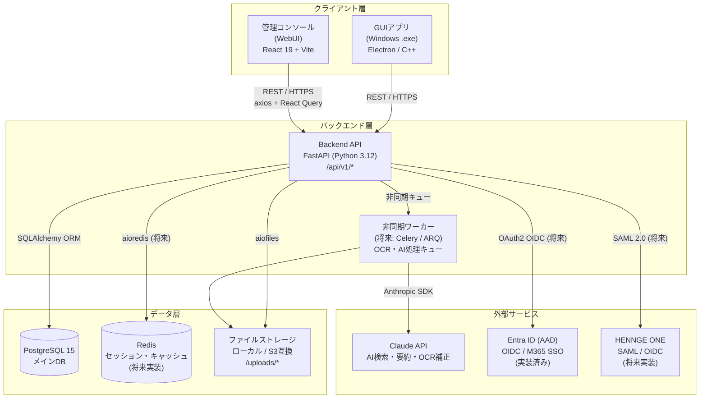
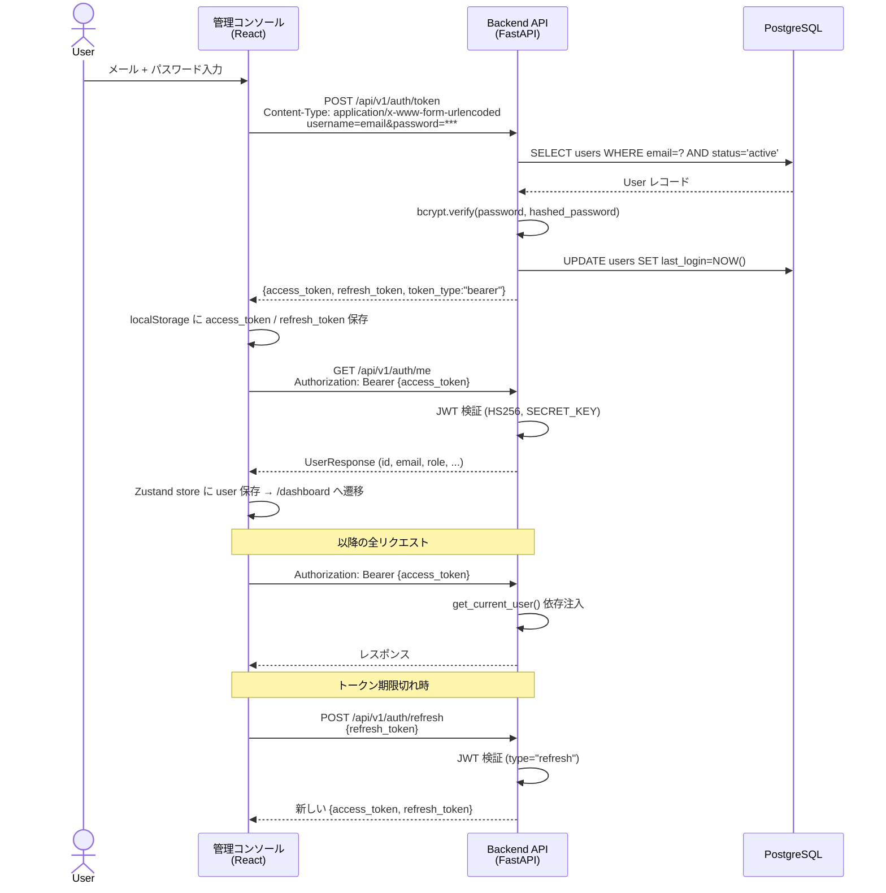
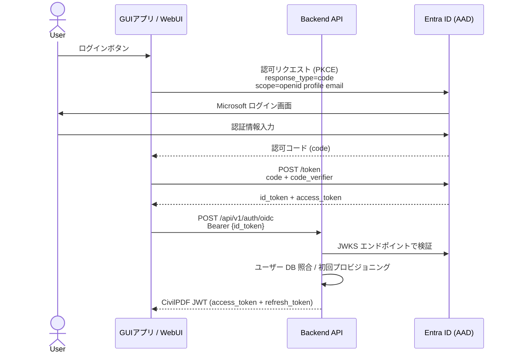
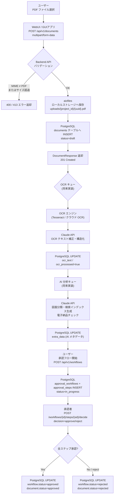

# CivilPDF-DX システム構成図

建設・土木業特化 PDF プラットフォームの全体アーキテクチャ定義書。

---

## 1. システム全体構成図



---

## 2. コンポーネント詳細

### 2.1 GUIアプリ（Windowsデスクトップ）

| 項目       | 内容                                                               |
| ---------- | ------------------------------------------------------------------ |
| 形態       | Windows 実行ファイル (.exe)                                        |
| 責務       | PDF 閲覧・注釈・OCR・図面比較・電子印鑑・電子納品チェック・AI検索  |
| オフライン | ローカルキャッシュによるオフライン動作対応（同期パネルで競合解決） |
| 通信       | Backend API へ REST/HTTPS で接続                                   |
| 認証       | JWT Bearer トークン＋Entra ID（M365 ログイン `/auth/m365/login`・OIDC）|
| 実装状況   | 計画中（MVP フェーズ外）                                           |

### 2.2 管理コンソール（WebUI）

| 項目              | 内容                                                       |
| ----------------- | ---------------------------------------------------------- |
| フレームワーク    | React 19 + Vite + TypeScript                               |
| 状態管理          | Zustand (認証状態) + TanStack Query v5 (サーバー状態)      |
| HTTP クライアント | axios（`/src/console/frontend/src/api/client.ts`）         |
| スタイリング      | Tailwind CSS v3                                            |
| ルーティング      | React Router v6                                            |
| 責務              | ユーザー・プロジェクト・ドキュメント・承認ワークフロー管理 |
| 実装状況          | MVP 完成済み（6 画面）                                     |

### 2.3 Backend API

| 項目           | 内容                                                                                    |
| -------------- | --------------------------------------------------------------------------------------- |
| フレームワーク | FastAPI (Python 3.12)                                                                   |
| ORM            | SQLAlchemy 2.x（同期モード）                                                            |
| バリデーション | Pydantic v2                                                                             |
| 認証           | JWT (HS256) — `PyJWT` + `passlib[bcrypt]`（2026-08 `python-jose` から移行、Issue #106） |
| ファイル処理   | `aiofiles` による非同期 PDF 保存（`api/documents.py`）                                  |
| API バージョン | `/api/v1/` プレフィックス                                                               |
| CORS           | `fastapi.middleware.cors.CORSMiddleware`                                                |
| ドキュメント   | Swagger UI (`/docs`)、ReDoc (`/redoc`)                                                  |
| ヘルスチェック | `GET /health`                                                                           |
| 実装状況       | 本番稼働中（2026-08-06〜）。19 ルーター構成                                             |

**実装済みルーター（2026-09-18 時点、`main.py` の `include_router` 実測。旧版は5件のみ記載しており実態と乖離していたため全件へ更新）:**

| プレフィックス          | ルーターファイル                                        | 主要領域                               |
| ----------------------- | ------------------------------------------------------- | -------------------------------------- |
| `/api/v1/auth`          | `api/auth.py`                                           | ログイン・トークン更新・プロフィール   |
| `/api/v1/users`         | `api/users.py`                                          | ユーザー管理（管理者限定）             |
| `/api/v1/projects`      | `api/projects.py`, `api/electronic_delivery.py`         | プロジェクト管理・電子納品             |
| `/api/v1/documents`     | `api/documents.py`, `api/editor.py`, `api/revisions.py` | 文書CRUD・CSV出力・Editor連携・版管理  |
| `/api/v1/workflows`     | `api/workflows.py`                                      | 承認ワークフロー                       |
| `/api/v1/organizations` | `api/organizations.py`                                  | 組織階層                               |
| `/api/v1/audit-logs`    | `api/audit_logs.py`                                     | 監査ログ・CSV出力・改ざん検知検証      |
| `/api/v1/stats`         | `api/stats.py`                                          | ダッシュボード統計・DX同期メトリクス   |
| `/api/v1/m365`          | `api/m365.py`                                           | Microsoft 365 連携                     |
| `/api/v1/ocr`           | `api/ocr.py`                                            | OCR                                    |
| `/api/v1/privacy`       | `api/privacy.py`                                        | GDPR削除権・保持ポリシー               |
| `/api/v1/ai`            | `api/ai.py`                                             | AI分類・構造化抽出・要約（Claude API） |
| `/api/v1/ai-config`     | `api/ai_settings.py`                                    | AI利用設定                             |
| `/api/v1/search`        | `api/search.py`                                         | 全文検索                               |
| `/api/v1/notifications` | `api/notifications.py`                                  | 通知                                   |
| `/api/v1/apps`          | `api/apps.py`                                           | PDF Editor Client 配信                 |

`api/csv_export.py` はルーターではなく共有ヘルパー（CSVストリーミング生成・数式インジェクション対策）で、
`documents.py`/`audit_logs.py` から呼び出される。単独では `include_router` されない設計で正しい。

### 2.4 PostgreSQL

| 項目             | 内容                                                                                                                                                                                |
| ---------------- | ----------------------------------------------------------------------------------------------------------------------------------------------------------------------------------- |
| バージョン       | **ローカル PostgreSQL 16**（現行は compose スタックの db コンテナ・named volume。2026-09-18 に Neon を廃止しローカルへ完全移行。開発/テストは SQLite）                                                              |
| 主要テーブル     | `users`, `organizations`, `projects`, `documents`, `document_versions`, `approval_workflows`, `approval_steps`, `audit_logs`, `notifications`, `dx_sync_metrics` 等                 |
| マイグレーション | Alembic（本番・開発共通）/ テストのみ `Base.metadata.create_all`                                                                                                                    |
| 接続             | SQLAlchemy 接続プール（`SessionLocal`）                                                                                                                                             |
| インデックス     | `documents(project_id/owner_id/status)` 追加（migration `l2m3n4o5p6q7`, 2026-09-18）。`audit_logs.sequence_number` を UNIQUE 化し改ざん検知の前提を保証（migration `m3n4o5p6q7r8`） |

### 2.5 ファイルストレージ

| 項目 | 内容                                                                      |
| ---- | ------------------------------------------------------------------------- |
| MVP  | ローカルファイルシステム（`settings.upload_dir`、デフォルト `./uploads`） |
| 将来 | S3 互換オブジェクトストレージ（MinIO / AWS S3 / Azure Blob）              |
| 構造 | `uploads/{project_id}/{uuid}.pdf`                                         |
| 制限 | PDF のみ (`application/pdf`)、最大サイズ `settings.max_file_size_mb` MB   |

### 2.6 AI / Claude API（実装済み）

| 項目       | 内容                                                                                          |
| ---------- | --------------------------------------------------------------------------------------------- |
| 用途       | 文書の分類・構造化抽出・要約（`/api/v1/ai/*`）、セマンティック検索のクエリ拡張                |
| 呼び出し   | API リクエスト内で同期的に呼ぶ（非同期ワーカーは未導入）                                      |
| 停止スイッチ | 管理者が `/api/v1/ai-config` で有効化したときだけ呼ぶ（既定は無効・fail closed）             |
| キー       | DB に Fernet 暗号化で保存（`/api/v1/ai-config`）。なければ環境変数 `ANTHROPIC_API_KEY`        |
| SDK        | Anthropic Python SDK                                                                          |

---

## 3. 認証フロー

### 3.1 現在の JWT 認証（MVP 実装済み）



### 3.2 Entra ID OIDC 認証（実装済み・下図は想定フロー）



---

## 4. データフロー

### 4.1 PDF アップロード → OCR → AI 分析 → 承認フロー



---

## 5. ネットワーク構成

### 5.1 対応デプロイ方式

```
オンプレミス構成（建設会社の社内サーバー）
┌─────────────────────────────────────────┐
│  社内 LAN / イントラネット                  │
│  ┌──────────┐  ┌──────────┐              │
│  │ WebUI    │  │ GUIアプリ │  ←  工事現場PC   │
│  │ (nginx)  │  │ (Windows) │              │
│  └─────┬────┘  └─────┬────┘              │
│        └──────┬───────┘                  │
│        ┌──────▼──────┐                   │
│        │  Backend API │                   │
│        │  (FastAPI)   │                   │
│        └──────┬───────┘                   │
│  ┌────────────┴──────────┐               │
│  │  PostgreSQL │  Files   │               │
│  └─────────────────────-─┘               │
└─────────────────────────────────────────┘
           ↑ HTTPS (自己署名 or 社内 CA)
    外部: Claude API / Entra ID のみ HTTPS 接続
```

### 5.2 ハイブリッド構成（クラウド連携）

| コンポーネント     | オンプレ                | クラウド                      |
| ------------------ | ----------------------- | ----------------------------- |
| GUIアプリ          | Windows クライアント PC | —                             |
| Backend API        | 社内サーバー / Docker   | Azure App Service             |
| PostgreSQL         | 社内 DB サーバー        | Azure Database for PostgreSQL |
| ファイルストレージ | NAS / 社内ディスク      | Azure Blob / AWS S3           |
| 認証               | JWT                     | Entra ID OIDC                 |
| AI API             | —                       | Claude API (HTTPS)            |

### 5.3 通信セキュリティ

| 経路             | プロトコル              | 備考                         |
| ---------------- | ----------------------- | ---------------------------- |
| WebUI → API      | HTTPS (TLS 1.2+)        | CORS ホワイトリスト制限      |
| GUIアプリ → API  | HTTPS (TLS 1.2+)        | 証明書ピニング（将来）       |
| API → PostgreSQL | TCP（社内ネットワーク） | 接続プール・暗号化オプション |
| API → Claude API | HTTPS                   | API キー認証                 |
| API → Entra ID   | HTTPS                   | JWKS 検証                    |

---

## 6. デプロイ構成

### 6.1 Docker Compose（開発・MVP）

```yaml
# docker-compose.yml 構成イメージ
services:
  db:
    image: postgres:15-alpine
    volumes: [postgres_data:/var/lib/postgresql/data]
    environment: [POSTGRES_DB, POSTGRES_USER, POSTGRES_PASSWORD]

  backend:
    build: ./src/console/backend
    depends_on: [db]
    environment:
      - DATABASE_URL=postgresql://...
      - SECRET_KEY=...
      - UPLOAD_DIR=/app/uploads
    volumes: [uploads:/app/uploads]
    ports: ["8000:8000"]

  frontend:
    build: ./src/console/frontend
    ports: ["3000:80"] # nginx で配信

  nginx:
    image: nginx:alpine
    ports: ["443:443", "80:80"]
    volumes: [./nginx.conf, ./certs]
```

### 6.2 Kubernetes（本番・将来）

```
Namespace: civilpdf-dx
├── Deployment: backend (FastAPI)  — replicas: 2+
├── Deployment: frontend (nginx)   — replicas: 2+
├── StatefulSet: postgresql         — PersistentVolumeClaim
├── Deployment: worker (Celery)    — OCR/AI 非同期処理
├── Service: backend-svc (ClusterIP)
├── Service: frontend-svc (ClusterIP)
├── Ingress: nginx-ingress (TLS 終端)
├── ConfigMap: app-config
├── Secret: db-secret, jwt-secret, claude-api-key
└── PersistentVolumeClaim: uploads-pvc
```

### 6.3 環境変数（必須設定）

| 変数名                        | 用途                             | 例                                        |
| ----------------------------- | -------------------------------- | ----------------------------------------- |
| `DATABASE_URL`                | PostgreSQL 接続文字列            | `postgresql://user:pass@db:5432/civilpdf` |
| `SECRET_KEY`                  | JWT 署名鍵                       | 32 バイト以上のランダム文字列             |
| `ACCESS_TOKEN_EXPIRE_MINUTES` | JWT 有効期限                     | `30`                                      |
| `REFRESH_TOKEN_EXPIRE_DAYS`   | リフレッシュトークン有効期限     | `7`                                       |
| `UPLOAD_DIR`                  | PDF 保存ディレクトリ             | `/app/uploads`                            |
| `MAX_FILE_SIZE_MB`            | PDF 最大サイズ                   | `100`                                     |
| `CORS_ORIGINS`                | CORS 許可オリジン                | `https://console.example.com`             |
| `ANTHROPIC_API_KEY`           | Claude API キー（任意・DB 設定がない場合に使用） | `sk-ant-...`                   |
| `AZURE_CLIENT_ID`             | Entra ID クライアント ID（将来） | `xxxxxxxx-...`                            |
